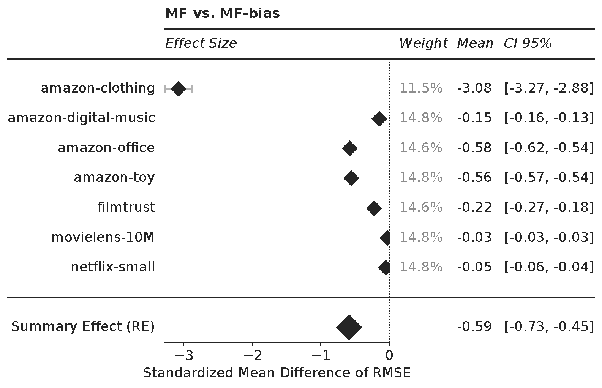

# Effect-Size-Based Meta-Analysis for Multi-Dataset Evaluation of RecSys Experiments

Welcome :wave: to the repo of our paper: 

Exploring Effect-Size-Based Meta-Analysis for Multi-Dataset Evaluation

**tl;dr** We address the essential yet complex task of evaluating Recommender Systems (RecSys) across multiple datasets. This is critical for gauging their overall performance and applicability in various contexts. Owing to the unique characteristics of each dataset and the variability in algorithm performance, we propose the adoption of effect-size-based meta-analysis, a proven tool in comparative research. This approach enables us to compare a 'treatment model' and a 'control model' across multiple datasets, offering a comprehensive evaluation of their performance. Through two case studies, we highlight the flexibility and effectiveness of this method in multi-dataset evaluations, irrespective of the metric utilized. The power of forest plots in providing an intuitive and concise summarization of our analysis is also demonstrated, which significantly aids in the communication of research findings. Our work provides valuable insights into leveraging these methodologies to draw more reliable and validated conclusions on the generalizability and robustness of RecSys models.

## Example

Effect sizes and corresponding confidence intervals are depicted as diamonds with whiskers ⊢♦⊣. The size of the diamonds is scaled by the experiments’ weights. The dotted vertical line at zero represents the zero effect. The observed effect size is not significant when its confidence interval crosses the zero effect line; in other words, we cannot detect the effect size at the given confidence level. In this case, we can expect that the treatment - MF-Bias - consistently and significantly outperforms - delivers smaller errors - than MF in all individual experiments and overall. 

## Running the Experiments
You can replicate our study by running experiments.ipynb. Therefore, create an environment with python=3.10.9 and install jupyter notebooks or lab. 
